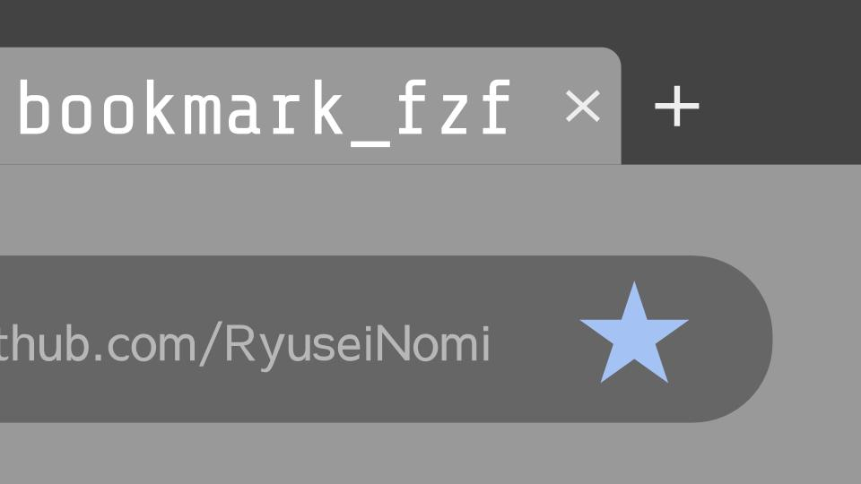
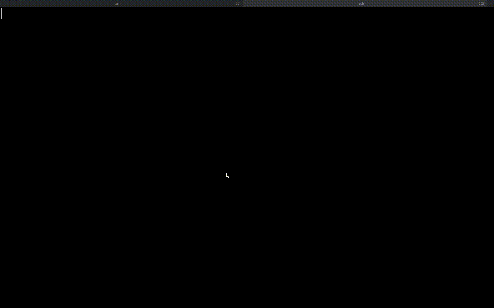

# bookmark_fzf



## About it

You can explore your web browsing via bookmarks from your terminal by using this command!

This command load Google Chrome bookmarks from your local machine and show as a list by using [fzf](https://github.com/junegunn/fzf) and open the link.

## Requirements

You need to install **bash version 4.0** or later to exec the command.

## Installation

You can get the command from homebrew

```
$ brew tap RyuseiNomi/tap
$ brew install RyuseiNomi/tap/bookmark_fzf
```


## Usage

The command has no parameter, no option. You can get explore just execute the command as below.

```
$ bookmark_fzf
```

## Demo



## License

> The MIT License (MIT)
>
> Copyright (c) 2013-2020 Junegunn Choi

https://github.com/junegunn/fzf
